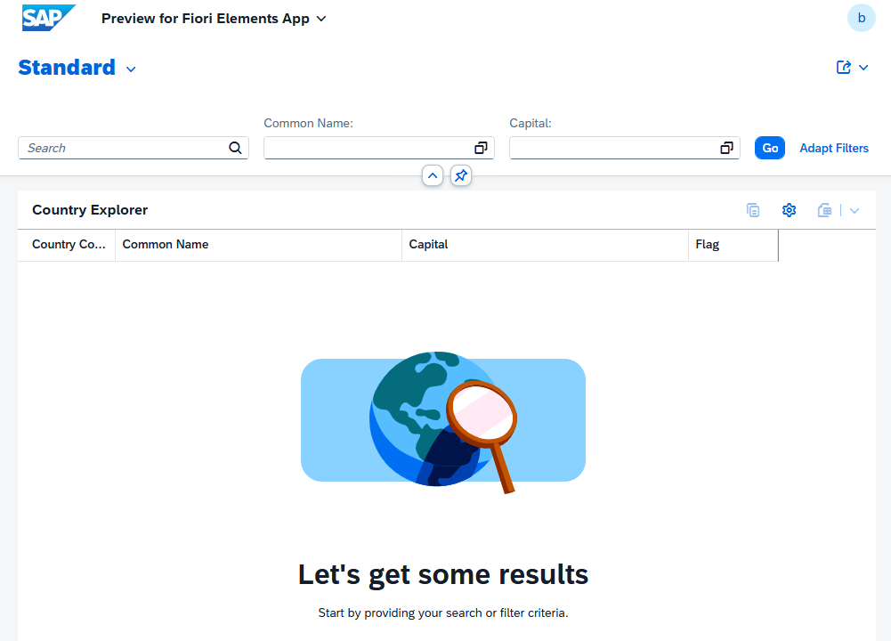
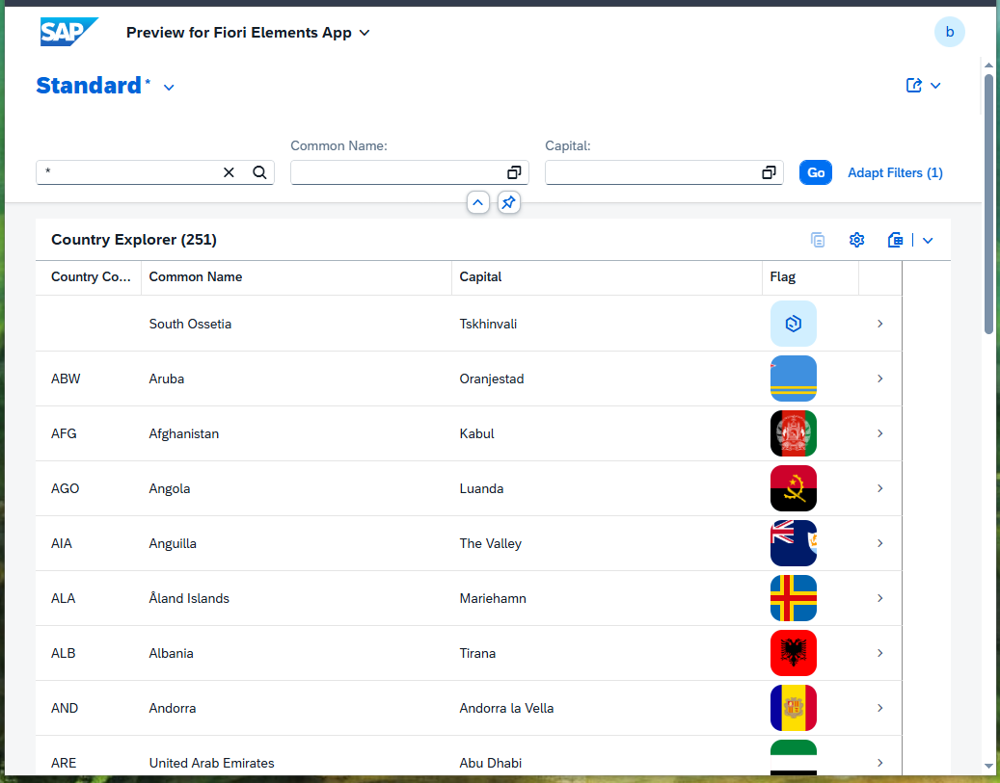
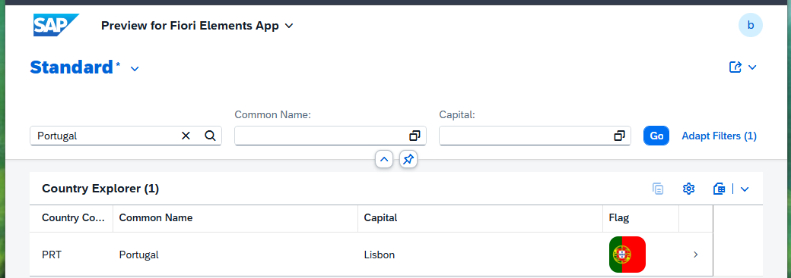
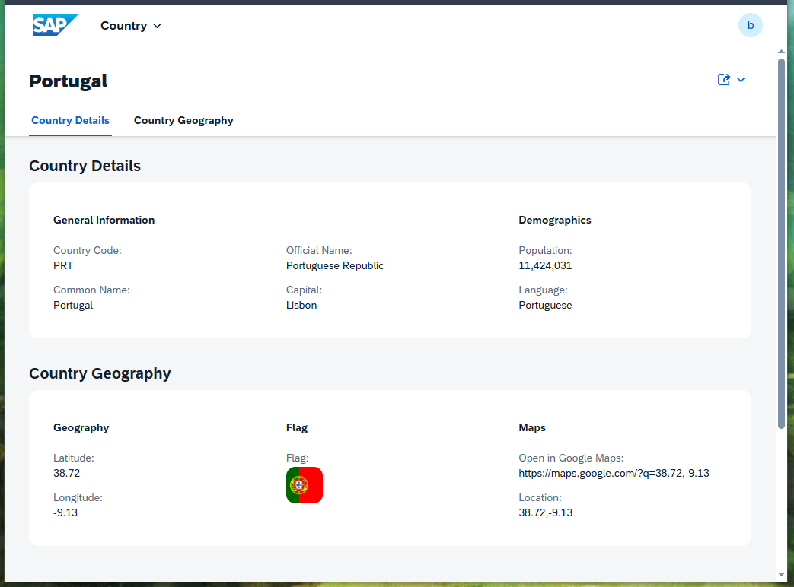
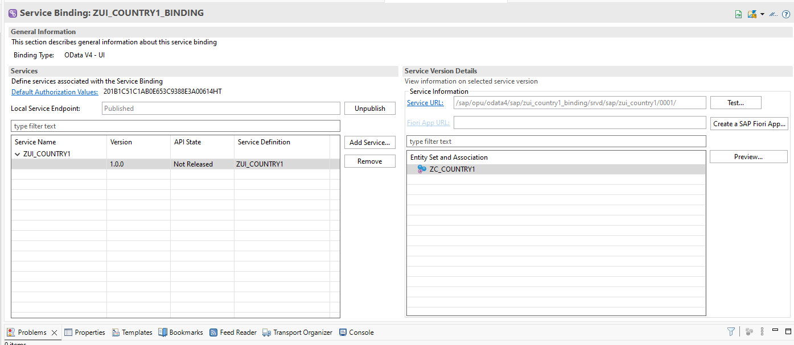
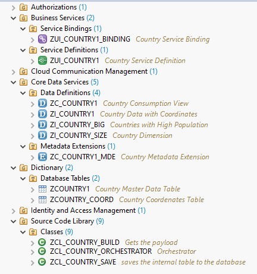

# SAP Country Explorer

## Overview

This is a personal SAP S/4HANA project developed using **ABAP Development Tools (ADT)** in Eclipse.

The project demonstrates an end-to-end SAP ABAP backend application that consumes data from an external REST API,
processes and transforms the JSON response, stores the data in custom SAP database tables,
exposes it through CDS Views and publishes the data as an **OData V4 service** for consumption by a **SAP Fiori Elements** application.

The project was developed to gain hands-on experience with modern SAP development using SAP S/4HANA, ABAP Cloud and SAP Fiori technologies.


## Features

### Completed
- ✅ Consume country data from the REST Countries API
- ✅ Handle API pagination using **limit** and **offset**
- ✅ Deserialize nested JSON into ABAP structures
- ✅ Transform nested API data into a flat internal table
- ✅ Persist data into custom SAP database tables
- ✅ Model data using CDS Interface Views
  
- ✅ Create a CDS Consumption View
- ✅ Configure UI annotations using a Metadata Extension
- ✅ Expose data through an OData V4 Service Definition
- ✅ Publish the service using an OData V4 Service Binding
- ✅ Generate and preview a SAP Fiori Elements application


## Screenshots

### 1. SAP Fiori Elements – List Report (Initial Screen)

The application starts with a standard SAP Fiori Elements List Report where users can search and filter countries.



---

### 2. SAP Fiori Elements – Country List

Displaying the countries retrieved from the REST Countries API.



---

### 3. Search and Filtering

Example of filtering the application by country name.



---

### 4. Object Page

Detailed country information generated automatically from CDS annotations and Metadata Extensions.



---

### 5. OData V4 Service Binding

Service Binding used to publish the OData V4 service and preview the Fiori Elements application.



---

### 6. ABAP Development Tools Project Structure

Project organization inside Eclipse ADT.



---

## Project Architecture

```text
REST Countries API
        │
        ▼
HTTP Client
        │
        ▼
JSON Response
        │
        ▼
ABAP Classes
(Build / Save / Orchestrator)
        │
        ▼
Custom Database Tables 
(ZCOUNTRY1 / ZCOUNTRY_COORD)
        │
        ▼
Interface CDS View 
(ZI_COUNTRY1)                            
        │                                   
        ├────────────► ZI_COUNTRY_BIG
        ├────────────► ZI_COUNTRY_SIZE
        ├────────────► Possible additional CDS Views
        │
        ▼                                
Consumption CDS View                     
(ZC_COUNTRY1)                            
        │
        ▼
Metadata Extension
(ZC_COUNTRY1_MDE)
        │
        ▼
Service Definition
(ZUI_COUNTRY1)
        │
        ▼
Service Binding
(OData V4)
        │
        ▼
SAP Fiori Elements Preview
```

## Project Structure

```text
src/
├── classes
│   ├── ZCL_COUNTRY_BUILD.abap
│   ├── ZCL_COUNTRY_SAVE.abap
│   └── ZCL_COUNTRY_ORCHESTRATOR.abap
│
├── cds
│   ├── ZI_COUNTRY1.ddls
│   ├── ZI_COUNTRY_BIG.ddls
│   └── ZI_COUNTRY_SIZE.ddls
│
├── dictionary
│   ├── ZCOUNTRY1.md
│   └── ZCOUNTRY_COORD.md
│
├── consumption
│   ├── ZC_COUNTRY1.ddls
│   └── ZC_COUNTRY1_MDE.ddlx
│
├── service
│   ├── ZUI_COUNTRY1.srvd
│   └── ZUI_COUNTRY1_BINDING.txt
```

## Technologies

- SAP S/4HANA
- ABAP Cloud
- SAP ABAP Development Tools (ADT)
- Eclipse
- SAP Dictionary
- CDS Views
- Metadata Extensions
- OData V4
- SAP Fiori Elements
- REST APIs
- HTTP Client
- JSON
- Git
- GitHub


